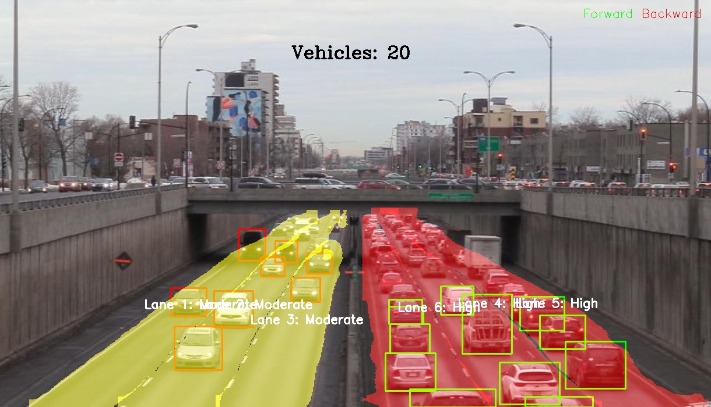

# Traffic-analysis

## DEMO:
Run file [demo.py](https://github.com/shreshth3000/traffic-analysis/blob/main/demo/demo.py) to view the video demonstration of the model.

## Output format

**Sample Output:**


1. Cars with green bounding boxes are moving forwards (towards the camera) and cars with red boundinf boxes are moving backwards(away from the camera)
2. The lane colours signify the trafic in that particular lane.

## Below are the different approaches with instructions to run and results for object detection.

### Model:
#### 1. YOLO 8 nano pretrained 
- [Training File](https://github.com/shreshth3000/traffic-analysis/blob/main/yolotrained.ipynb)
- [best.pt](https://github.com/shreshth3000/traffic-analysis/blob/main/models/yolo8nbest.pt)
##### Dependencies:
```
pip install ultralytics
```
##### Results:
- mAP@0.50: 0.9755
- mAP@0.50-0.95: 0.7320
- Precision: 0.9004
- Recall: 0.9391

#### 2. YOLOv8 trained from scratch

##### Dependencies:
```
pip install ultralytics
```
##### Results:
- mAP@0.50: 0.96
- mAP@0.50-0.95: 0.73
- Precision: 0.92
- Recall: 0.90

#### 3. Single Shot Detector -finetuned

##### Dependencies:
```
pip install torch torchvision
```
##### Results:
- mAP@0.50: 0
- mAP@0.50-0.95: 0
- Precision: 0
- Recall: 0
## Below are the different approaches with instructions to run and results for lane detection.


## Below are the different approaches with instructions to run and results for direction detection.
